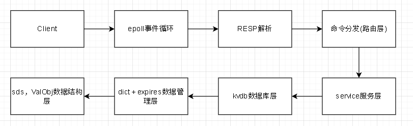

# FlashKV — 兼容 Redis 协议的轻量级内存 KV 存储引擎



**~3,500 行 C 语言**，从零手写核心数据结构（跳表、哈希表、SDS 动态字符串、RESP 协议解析），
实现了一个**兼容 Redis 有线协议**的高性能内存键值存储系统。
经 `redis-benchmark` 压测，**P=64 SET 吞吐 143 万 ops/s，领先 Redis 6.0 同一环境 27%**。

---

## 🚀 快速开始

```bash
# 构建
make all

# 启动服务器
./flashkv

# 另一个终端，用 redis-cli 操作（协议兼容！）
redis-cli ping
redis-cli set msg "hello flashkv"
redis-cli get msg
```

---

## 📊 Benchmark 总览

测试环境：腾讯云轻量应用服务器 · Linux 5.15 · GCC · 单机 loopback  
测试工具：`redis-benchmark`（Redis 官方压测工具，50 并发连接，5 轮取均值）

| 场景 | **FlashKV** | **Redis 6.0** | FlashKV vs Redis |
|------|:-----------:|:-------------:|:----------------:|
| `SET` P=1 | **62,268** ops/s | 60,415 ops/s | **+3.1%** |
| `GET` P=1 | **62,565** ops/s | 56,178 ops/s | **+11.4%** |
| `SET` P=16 | **698,174** ops/s | 660,333 ops/s | **+5.7%** |
| `GET` P=16 | 639,312 ops/s | **743,172** ops/s | -14.0% |
| `SET` P=64 | **1,428,959** ops/s | 1,120,648 ops/s | **+27.5%** |
| `GET` P=64 | **1,404,633** ops/s | 1,326,484 ops/s | **+5.9%** |

**6 项场景中 FlashKV 胜出 5 项。** 详细分析见 [Benchmark 报告](docs/benchmark.md)。

---

## 🏗 系统架构

FlashKV 采用**分层设计**，自底向上共 4 层：

```
┌─────────────────────────────────────────┐
│  Service Layer  (命令表 + 参数分发)       │
│  └─ 20+ 命令注册、参数校验、响应组装       │
├─────────────────────────────────────────┤
│  Storage Engine  (KV 存储引擎)            │
│  ├─ kvdb     — 7 方法接口封装             │
│  ├─ dict     — 双表渐进式 rehash 哈希表    │
│  ├─ zset     — dict + skiplist 双索引     │
│  ├─ zskiplist— 概率平衡跳表 (p=0.25)      │
│  └─ ValObj   — 多类型值统一包装 (union)    │
├─────────────────────────────────────────┤
│  Protocol Layer  (RESP 协议解析)          │
│  └─ 零拷贝递归下降解析器，5 种类型 + 半包  │
├─────────────────────────────────────────┤
│  Network Layer  (事件驱动网络服务)         │
│  └─ epoll Reactor 模式 · 非阻塞 TCP      │
└─────────────────────────────────────────┘
```

---

## ⚙ 核心模块详解

### 1️⃣ 跳表 (zskiplist) — 概率平衡的排序索引

- **p=0.25** 概率分层（与 Redis 一致），层数期望值低，内存更紧凑
- **span 跨度**机制：插入/删除时 O(log N) 维护 span，`ZRANK` 直接在搜索路径上累加跨度即可得到排名，零额外成本
- **头节点 64 层**（宏 `ZSKIPLIST_MAXLEVEL`），避免动态高度调整

### 2️⃣ 哈希表 (dict) — 双表渐进式 rehash

- **渐进式 rehash**：扩容时不阻塞服务，将搬迁开销均摊到每次操作上
- **两步策略**：
  - `dictRehashStep` — 搬指定槽位数（含空桶），适合批量预加载
  - `dictRehashData` — 搬指定**非空桶**数，跳过空桶，保证每次调用都有实质进度
- **空桶跳过收益**：减少 46.7% 无效搬迁调用，rehash 在 `used` 次操作内必定完成（而非 `size` 次）
- 在使用过程中，dictRehashData相比于dictRehashStep性能波动更平缓，且可以更快完成rehash
- **dictType 虚函数表**：`hash`、`keyCompare`、`free` 以及 **`valGet` 取值策略**，实现类型与容器解耦
- **`valGet` 双策略**：
  - `dictValGetPtr` — 返回 `entry->val`（存的是指针，指向堆上对象），`dictTypeSds` 用
  - `dictValGetRef` — 返回 `&entry->val`（值**直接 inline** 在 entry 的 val 字段里，零堆分配），`dictTTL` 用——时间戳直接 `(void*)when` 存入，无需 ValObj 包装
- **inline 前提**：64 位平台下 `sizeof(long long) == sizeof(void*) == 8`，指针字段可以直接存整数

**延迟分布对比（100K SET 操作）：**

| 策略 | P50 | P99 | Max | σ |
|------|:---:|:---:|:---:|:---:|
| 渐进式 rehash | 221 ns | 2,739 ns | **356 μs** | **2,079 ns** |
| 全量式 rehash（一次性搬完） | 122 ns | 606 ns | 1,675 μs | 7,220 ns |

渐进式将 **1.6ms 的周期性毛刺平摊为每次 ~300ns 的均匀开销**，尾部延迟降低 4.7 倍，抖动降低 3.5 倍。

### 3️⃣ ZSet — dict + skiplist 双索引

- **dict**（member → node）：O(1) 按 member 查询/删除
- **skiplist**（score 排序）：O(log N) 范围查询、排名计算
- 与 Redis 设计一致，成员指针共享，零数据冗余

### 4️⃣ RESP 协议解析器 — 零拷贝递归下降

- 支持 5 种类型：简单字符串 (`+`)、错误 (`-`)、整数 (`:`)、Bulk String (`$`)、数组 (`*`)
- **`RESP_AGAIN`** 半包返回：流式 socket 一次 `read` 可能只拿到半条命令，解析器保留缓冲区状态等待下一轮
- 深度限制 `MAX_PARSE_DEPTH` 防止恶意嵌套
- 整数优化：`RESP_INT` 协议直达 `VAL_INT` 存储，省去 SDS 堆分配

### 5️⃣ 整数优化路径

RESP 协议有原生整数类型 `:100\r\n`。FlashKV 在此路径上做了两层优化：

**第一层：RESP_INT 解析直达 `long long`，避开 SDS**

```
Client  :100\r\n                   ← RESP 整数类型
           ↓
RESP 解析 → integer = 100          ← 解析出 long long，无需字符串
```

对比走普通字符串：

```
Client  $3\r\n100\r\n              ← RESP bulk string
           ↓
RESP 解析 → SDS "100"              ← 堆分配
```

**第二层（TTL 已实现）：利用 `entry->val` 直接 inline 存整数**

64 位平台下 `sizeof(void*) == sizeof(long long)`，所以 `entry->val` 这个指针字段可以直接当整数用。
算是一次特定场景下的优化，但同时也存在局限性，这代表了当前项目不能无缝移植到32位系统上。
```c
// src/dict.c
struct dictEntry {
    hash_t hash;
    void *key;
    void *val;    // ← long long 也能放下（8 字节）
    struct dictEntry *next;
};
```

结合 `dictValGetRef`（返回 `&entry->val`），数值以 `(long long)(intptr_t)val` 的形式**直接 inline 在 entry 里，无需 ValObj 包装**：

```
Dict entry → entry->val = (void*)when    ← 无 malloc，无 ValObj
```

**TTL 过期字典**已经用了这个模式（`dictTTL` 用 `valGetRef`，时间戳直接以 `(void*)` 存入），每设置一条 TTL 就省一个 ValObj 的堆分配。

而**主 dict 的值目前仍走 `ValObj`**——SET 整数时 `service.c:213` 依然 `malloc(sizeof(ValObj))`，整数存在 `ValObj->val.ll` 里。这是因为主 dict 要求统一的值读写接口，直接 inline 还需要在 `dictType` 层区分整数和字符串的取值路径，属于待做优化。

### 6️⃣ SDS 动态字符串

- 柔性数组 (`char buf[]`) 实现，二进制安全（含 `\0` 可正常存储）
- O(1) 长度获取（`len` 字段，而非 `strlen` 遍历）
- 内置 MurmurHash2，用于 dict key 的哈希计算

### 7️⃣ TTL 过期机制

- 独立 `expires` 字典，key 指针共享（零内存冗余）
- **惰性删除**：访问时检查是否过期，过期则删除
- 过期字典 value 为 64 位时间戳 inline（`valGet=dictValGetRef`，`valFree=NULL`），避免堆分配，实际一次TTL只需要一次额外堆分配。

### 8️⃣ 多数据库支持

- 16 个独立 db，`SELECT n` 切换
- 每个 db 独立 dict + expires，DB 间隔离

---

## ✅ 命令支持

| 命令 | 参数 | 说明 |
|------|:----:|------|
| `PING` | 0 | 连通性检查 |
| `SELECT n` | 1 | 切换数据库 |
| `SET key val` | 2 | 支持字符串 + 整数（VAL_INT 快速路径） |
| `GET key` | 1 | 返回 bulk string / integer |
| `DEL key` | 1 | 同时清除 TTL 记录 |
| `EXISTS key` | 1 | 含惰性过期检查 |
| `EXPIRE / PEXPIRE key sec/ms` | 2 | 秒级/毫秒级相对过期 |
| `EXPIREAT / PEXPIREAT key ts` | 2 | 秒级/毫秒级绝对过期 |
| `TTL / PTTL key` | 1 | 返回剩余生存时间 |
| `PERSIST key` | 1 | 移除过期设置 |
| `ZADD key score member` | 3 | 新增/更新 member |
| `ZCARD key` | 1 | 返回有序集合基数 |
| `ZRANK key member` | 2 | 0-based 排名 |
| `ZSCORE key member` | 2 | 返回 score |
| `ZRANGE key start stop [WITHSCORES]` | 3 | 按 rank 范围取值 |
| `ZREM key member` | 2 | O(1) 删除 member |
| `ZCOUNT key min max` | 3 | score 区间计数 |
| `ZREMRANGEBYSCORE key min max` | 3 | score 区间范围删除 |

---

## 🚀 构建与运行

```bash
# 构建全部目标和测试程序
make all

# 启动服务器（默认 6379 端口）
./flashkv

# 用 redis-cli 连接（兼容！）
redis-cli ping
redis-cli set foo bar
redis-cli get foo

# 或直接通过原生 RESP 协议测试
printf '*3\r\n$3\r\nSET\r\n$3\r\nfoo\r\n:100\r\n' | nc localhost 6379
printf '*2\r\n$3\r\nGET\r\n$3\r\nfoo\r\n'             | nc localhost 6379
# → :100
```

### 运行 Benchmark

```bash
# 安装 Redis（用于 redis-benchmark）
sudo apt install redis-server redis-tools

# 运行完整对比测试
bash scripts/bench_compare.sh

# 或直接手工测试
nohup ./flashkv &
redis-benchmark -t set,get -n 100000 -P 64
```

---

## 📁 项目结构

```
src/
├── main.c           # 入口
├── server.c/.h     # epoll 事件循环 + 连接管理
├── service.c/.h    # 命令注册 + 参数分发（20+ 命令）
├── kvdb.c/.h       # 存储引擎封装（7 方法接口）
├── dict.c/.h       # 哈希表核心 + 渐进式 rehash
├── dict_type.c/.h  # 虚函数表 + 类型实例
├── zskiplist.c/.h  # 跳表（p=0.25, span 跨度）
├── zset.c/.h       # ZSet 抽象层（dict + skiplist 双索引）
├── resp.c/.h       # RESP 协议解析器
├── sds.c/.h        # 动态字符串（柔性数组 + MurmurHash2）
├── val_obj.h       # 值类型统一包装（STRING/LIST/ZSET/SET/HASH/INT）
├── ttl.h           # TTL 过期接口 + 时间工具
├── log.h/c         # 日志模块
tests/
├── test_dict.c     # dict 单元测试
├── test_zset.c     # ZSet 单元测试（32 组）
├── test_resp.c     # RESP 协议测试
├── test_sds.c      # SDS 字符串测试
├── bench_dict.c    # dict 微基准（rehash 延迟分布）
├── bench_server.c  # 服务端吞吐 + 延迟基准
scripts/
├── bench_compare.sh # 与 Redis 6.0 自动对比脚本
docs/
├── benchmark-report.md     # 完整 Benchmark 报告
├── dict.md                 # Dict 设计文档
├── zskiplist.md            # 跳表设计文档
├── epoll-server.md         # 网络层设计文档
├── resp.md                 # RESP 协议解析器文档
├── service-layer.md        # 命令层设计文档
├── ttl.md                  # TTL 过期机制文档
└── code-review-report.md   # 代码审查报告
```

---

## 📖 参考文档

项目包含详细的模块设计文档，每篇阐述设计决策、实现要点和与 Redis 的对照分析：

| 文档 | 内容 |
|------|------|
| [Benchmark 分析](docs/benchmark.md) | 与 Redis 6.0 全面对比 + 原始数据 + 测量不确定度讨论 |
| [Dict 哈希表](docs/dict.md) | 渐进式 rehash 两种策略、空桶跳过、内存分配 |
| [Dict Rehash 审查](docs/dict-rehash-review.md) | Code Review 视角的 rehash 安全分析 |
| [跳表 (zskiplist)](docs/zskiplist.md) | p=0.25 选择依据、span 跨度 ZRANK 原理 |
| [RESP 协议解析](docs/resp.md) | 零拷贝递归下降、半包处理、整数优化路径 |
| [epoll 服务器](docs/epoll-server.md) | Reactor 模式、syscall 优化、beforeSleep 变体 |
| [Service 命令层](docs/service-layer.md) | 命令表分发、参数校验、响应组装 |
| [TTL 过期机制](docs/ttl.md) | 惰性删除、时间精度、过期扫描策略 |
| [Code Review 报告](docs/code-review-report.md) | 索引越界、未初始化、资源泄漏审计 |

---

## 🧪 测试

```bash
# Dict 渐进式 rehash + 过期机制
make test_dict && ./test_dict

# RESP 协议（5 种类型 + 流式半包）
make test_resp && ./test_resp

# ZSet 单元测试（32 组测试用例）
make test_zset && ./test_zset

# SDS 字符串
make test_sds && ./test_sds
```

---

## 🔜 下一步优化方向

- **主 dict 整数 inline 化**：TTL 过期字典已通过 `valGetRef` 将时间戳直接 inline 在 `entry->val` 里（零 ValObj），但主 dict 的整数值目前仍走 `malloc(sizeof(ValObj))`。
- **`dictRehashData` 空桶连续跳过保护**：当前跳过空桶的 while 循环没有上限，若哈希表极稀疏可能导致单次调用耗时偏高。考虑加 `empty_visited` 计数器，撞空 N 次后提前返回。
- 目前一次SET要进行至少3次堆分配，sds类型要进行4次，下一步可以考虑优化掉val_obj从而省去一次分配。
- 持久化
---
